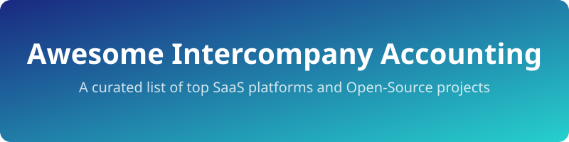

  

# ✨ Awesome-Intercompany-Accounting ✨

  

## 🌐 Top Intercompany Accounting Tools Ecosystem

**Curated List of SaaS/Commercial Products & Open-Source GitHub Projects** 🚀  
*Focused on Intercompany Reconciliation, Matching, Eliminations, Financial Close, Consolidation & Multi-Entity Reporting* 📊  
**Last updated: August 2026** 📅

This repository tracks notable **SaaS platforms** ☁️ and **open-source projects** 🛠️ for **Intercompany Accounting**. These tools help multi-entity organizations match and reconcile intercompany transactions, perform eliminations, manage the financial close, and produce consolidated financial statements.

**Examples** include BlackLine Intercompany, Trintech Cadency, FloQast, OneStream, Oracle Financial Consolidation, SAP Intercompany Matching, Lucanet, CCH Tagetik, Planful, and Workiva (the category leaders). 🥇

**Open-source emphasis**: This section is heavily expanded with available projects. Mature, production-grade open-source alternatives specifically for enterprise intercompany hubs and automated financial close remain limited. Most open-source capabilities come from ERP multi-company features, emerging EPM tools, and reconciliation/matching modules built on top of open ERPs. 💻

Contributions welcome! Open a PR to add/update entries. Keep descriptions factual and link to official sites. 🤝

## 📑 Table of Contents
- [SaaS/Hosted Platforms](#-saashosted-platforms)
- [Open-Source GitHub Projects](#-open-source-github-projects)
- [How to Contribute](#-how-to-contribute)
- [Disclaimer](#-disclaimer)

## ☁️ SaaS/Hosted Platforms

| Product | Description | Pricing | Free Tier Limit | Company Size / Valuation |
|---------|-------------|---------|-----------------|--------------------------|
| **[Oracle Financial Consolidation & Close](https://www.oracle.com/)**, **[SAP Intercompany Matching / Group Reporting](https://www.sap.com/)** | Enterprise consolidation and intercompany solutions tightly integrated with their respective ERP and financial suites. | Custom Pricing (Enterprise Agreements based on modules) | No Free Tier Available | $300B+ |
| **[Workiva](https://www.workiva.com/)** | Additional platforms covering consolidation, intercompany, close management, reporting, and connected financial processes for mid-market to enterprise organizations. | Custom Quote (Volume & Module based) | No Free Tier Available | $4.5B |
| **[BlackLine Intercompany](https://www.blackline.com/)** | Enterprise intercompany hub and financial close platform offering automated matching, dispute resolution, eliminations support, and strong audit/SOX capabilities for complex multi-entity organizations. | Custom Pricing (Enterprise quote based on user/entity count) | No Free Tier Available | $3.5B |
| **[OneStream](https://www.onestream.com/)** | Unified CPM platform combining financial consolidation, intercompany eliminations, planning, and close processes in a single environment. | Custom Pricing (Enterprise Quote) | No Free Tier Available | $2.5B |
| **[FloQast](https://www.floqast.com/)** | Mid-market financial close management platform focused on close task orchestration, reconciliations, and ERP-linked workflows with more limited but practical intercompany support. | Custom Quote (Per user/seat pricing) | No Free Tier Available | $1.6B |
| **[Lucanet](https://www.lucanet.com/)** | Additional platforms covering consolidation, intercompany, close management, reporting, and connected financial processes for mid-market to enterprise organizations. | Custom Quote (Based on entities/users) | No Free Tier Available | ~$1B |
| **[CCH Tagetik](https://www.tagetik.com/)** | Additional platforms covering consolidation, intercompany, close management, reporting, and connected financial processes for mid-market to enterprise organizations. | Custom Pricing (Enterprise Quote) | No Free Tier Available | ~$1B |
| **[Planful](https://planful.com/)** | Additional platforms covering consolidation, intercompany, close management, reporting, and connected financial processes for mid-market to enterprise organizations. | Custom Quote (Based on modules) | No Free Tier Available | ~$500M |
| **[Trintech Cadency](https://www.trintech.com/)** | Financial close and reconciliation platform with intercompany matching, account reconciliation, and controls designed for regulated and enterprise environments. | Custom Pricing (Enterprise Agreements) | No Free Tier Available | ~$500M |

## 🛠️ Open-Source GitHub Projects

| Product | Description | Stars |
|---------|-------------|-------|
| **[Odoo](https://github.com/odoo/odoo)** | Modular open-source ERP with multi-company support, consolidation tools, and community/partner modules for intercompany trade and related accounting flows. |  |
| **[ERPNext](https://github.com/frappe/erpnext)** | Fully open-source ERP with multi-company accounting, intercompany transactions (sales/purchase), and consolidation capabilities. Provides a practical foundation for smaller multi-entity groups. |  |
| **[Firefly III](https://github.com/firefly-iii/firefly-iii)** | A personal finances manager that can be adapted for simple multi-entity bookkeeping and transfers. |  |
| **[Akaunting](https://github.com/akaunting/akaunting)** | Free, online and open source accounting software for small businesses. |  |
| **[Ledger](https://github.com/ledger/ledger)** | Powerful, double-entry accounting system that is accessed from the UNIX command-line. |  |
| **[Beancount](https://github.com/beancount/beancount)** | Double-entry accounting computer language that lets you define financial transaction records in a text file, read them in memory, generate a variety of reports from them. |  |
| **[Frappe Accounting](https://github.com/frappe/accounting)** | A simpler accounting module by Frappe. |  |
| **[Odoo intercompany trade addons](https://github.com/grap/odoo-addons-intercompany-trade)** | Community modules extending Odoo for intercompany trade and related accounting processes. |  |
| **[Taraz and multi-entity accounting engines](https://github.com/MRThugh/taraz)** | Open-source double-entry accounting engines that include multi-entity consolidation, multi-currency, and related financial reporting capabilities. |  |
| **[Matcha (ERPNext)](https://github.com/Negentropy-Solutions/matcha)** | Open-source payment reconciliation app for ERPNext that supports cross-company (intercompany) reconciliation and posts necessary bridge journal entries. |  |
| **[Konsolidat](https://github.com/konsolidat/konsolidat)** | Emerging open-source, Excel-native EPM platform focused on consolidation, FX translation, allocations, and sophisticated intercompany eliminations (IC trading, profit-in-inventory, loans, etc.). |  |

### ➕ Additional Strong Open-Source Options

- Custom reconciliation and matching scripts built on top of ERPNext or Odoo data models.
- dbt or SQL-based consolidation and elimination models running on a warehouse.
- Spreadsheet-driven close checklists combined with open ERP data for lighter multi-entity needs.
- Many research or internal tools for intercompany matching that are partially released as open source.

**Frameworks for building custom systems**: For smaller or mid-complexity groups start with **ERPNext** or **Odoo** multi-company + intercompany features and extend with matching modules (such as Matcha). For more advanced consolidation and eliminations explore **Konsolidat** or build elimination logic on a modern data stack. Enterprise-scale intercompany hubs with high volume, multilateral netting, and strong audit requirements still typically rely on commercial platforms such as BlackLine or OneStream.

## 🤝 How to Contribute

1. Fork the repo. 🍴
2. Add/edit entries in `README.md` (follow existing format). 📝
3. Include: name, link, 1–2 sentence description, and whether it's SaaS/commercial or open-source. 🔗
4. Submit PR with a short explanation. 📤

Star the repo if you find it useful! ⭐

## ⚠️ Disclaimer

- This is a **community-curated** list — not exhaustive and not an endorsement.
- Intercompany accounting and financial consolidation involve complex accounting standards (IFRS, US GAAP), audit requirements, and internal controls. Open-source tools can support multi-entity bookkeeping and basic consolidation but are rarely full replacements for enterprise intercompany hubs or certified close platforms used in large, regulated organizations.
- Always involve accounting, audit, and IT stakeholders, and validate results against formal consolidation rules and controls before relying on any system for official reporting.

---

**Made for finance teams, controllers, and multi-entity organizations seeking more transparent intercompany and close tooling.** 💼  
Let's make financial close and consolidation more open where practical. 🌍

## 📈 Star History

<a href="https://www.star-history.com/?repos=ishandutta2007%2FAwesome-Intercompany-Accounting&type=date&legend=bottom-right">
<picture>
<source media="(prefers-color-scheme: dark)" srcset="https://api.star-history.com/chart?repos=ishandutta2007/Awesome-Intercompany-Accounting&type=date&theme=dark&legend=bottom-right" />
<source media="(prefers-color-scheme: light)" srcset="https://api.star-history.com/chart?repos=ishandutta2007/Awesome-Intercompany-Accounting&type=date&legend=bottom-right" />

</picture>
</a>

